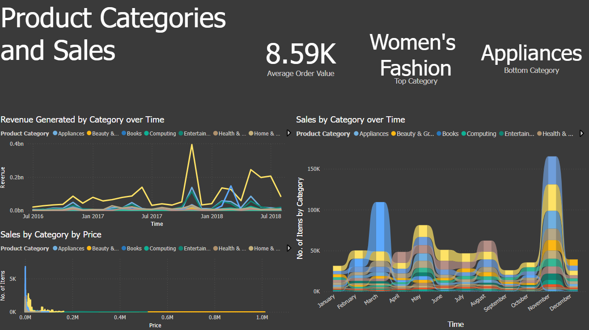
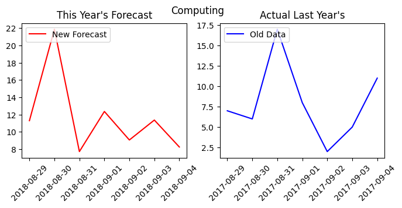

# Intro

<b>Project Type</b>: Data Analytics 
<b>Domain</b>: Ecommerce

### Description
#### v1
A Power BI data analysis project for Pakistan's ecommerce sites. Along with basic forecasting done using ARIMA and XGBRegressor in python.

# Sample Report Page

# Sample Forecasting Chart

# KPIs
[KPIs used in this report](proposals/stakeholder%20report%20proposal.pdf)

# Dataset Link
https://www.kaggle.com/datasets/zusmani/pakistans-largest-ecommerce-dataset/data