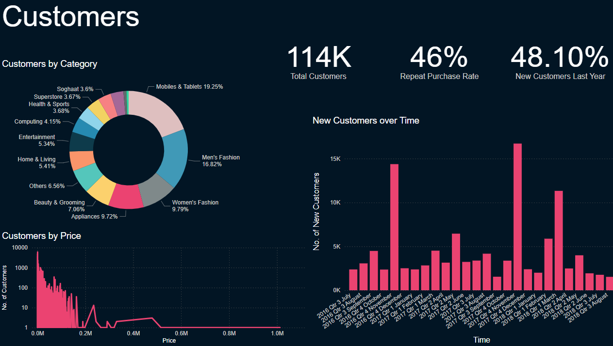

# Description
A Power BI data analysis project for Pakistan's ecommerce sites. Along with basic forecasting done using ARIMA and XGBRegressor in python.

## Problems:
We are interested in the following:
1. Performance
    1. Sales
    2. Products
    3. Customers
2. Forecast
    1. Sales
    2. Customers
3. Risk
    1. Customer Retention Rate
    2. Refunds

More details can be found in the pdf at:
```
project
├───reports
    └───stakeholder report proposal.pdf
```

## Insights:
1. Top revenue generating items are from the Mobiles and Tablets Category. We should increase investment in that category.
2. Top selling items are from the women's fashion category. We have a steady market, we should explore more opportunity here.
3. Top sales are made in the month of November. We must handle our inventory better during October.
4. Men's products are most sold in November, we should stock up on a variety of men's items and display ads in October and early November.
5. Almost 50% customers come back for more products. We add discounts perhaps to retain them further?
6. Men's items have the most refunds. We should investigate this and come up with strategize to reduce the refunds.
7. Most of our customers, 85%, don't buy within a year. We should target them with some specialized ads because we have their emails.
8. School items are a threat, they have the least sales. If we are investing too heavily into school items we should cut that down.

# KPIs
[KPIs used in this report](proposals/stakeholder%20report%20proposal.pdf)

# Dataset Link
https://www.kaggle.com/datasets/zusmani/pakistans-largest-ecommerce-dataset/data